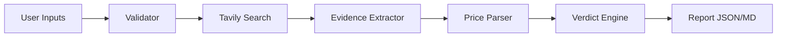

# PTM Visualization Spec (for Cursor code generation)
**Project:** Pricing Truth Machine (PTM)  
**Purpose:** Implement all *relevant* visualizations for PTM outputs with a focus on **evidence-first trust**.  
**Primary UI target:** **Streamlit** (fast MVP)  
**Secondary targets (optional later):** Next.js + Recharts/Vega-Lite

---

## 0) Hard rules (must-follow)
1. **Evidence before conclusions.** Every chart/table must allow a user to trace back to the **source URL**.
2. **No invented data.** If a field is missing, show it as missing and surface it in **Gaps**.
3. **Highlight the user’s product** in every comparison view.
4. **UNDETERMINABLE is a valid outcome**, not an error.

---

## 1) Input data contract
### 1.1 Required input file(s)
- `report.json` produced by PTM (PricingVerdict-like)
- Optional: `report.md` (human report) — not required for charts

### 1.2 Minimal JSON fields expected (verbatim names)
Your visualization code should accept at least:

```json
{
  "status": "FAIR",
  "confidence": "MEDIUM",
  "summary": "…",
  "key_reasons": ["…"],
  "gaps": ["…"],
  "competitor_table": [
    {
      "competitor_name": "Competitor1",
      "competitor_url": "https://competitor1.com/pricing",
      "extracted_price_texts": ["Pricing starts at $25 per month …"],
      "normalized_monthly_usd": 25.0,
      "notes": "Normalized (cadence detected: month)."
    }
  ],
  "citations": [{"url": "…", "title": "…"}]
}
```

### 1.3 Additional fields recommended (if available)
If your PTM pipeline can output these, charts become more useful:
- `product`: object with:
  - `product_name`, `product_url`, `current_price`, `pricing_model`, `target_customer`, `problem_statement`
- `sources_used`: array of `{url, title, score, content_excerpt?}`

**Visualization must degrade gracefully** if optional fields are absent.

---

## 2) Pages / layout (Streamlit)
**Single-page MVP layout** (recommended):
1. Header + product identity
2. Verdict panel (status + confidence)
3. Price comparison chart
4. Evidence table (with clickable sources)
5. Gaps / Limitations box
6. (Optional) Dataflow diagram (Mermaid) for technical audiences
7. (Optional) Audit trail / timeline metadata

---

## 3) Visual components (must implement)

### 3.1 Verdict panel (KPI cards)
**Goal:** instant understanding + credibility.
- Show:
  - `status` as a big badge: 🟢 FAIR / 🟡 UNDERPRICED / 🔴 OVERPRICED / ⚪ UNDETERMINABLE
  - `confidence` as a progress bar (map HIGH/MEDIUM/LOW to 0.85/0.6/0.35 or similar)
  - `summary` as 1–2 lines
- If `status == UNDETERMINABLE`, show a short “why” line based on `gaps`.

**Streamlit implementation hints:**
- `st.metric` or custom HTML/CSS for the badge
- `st.progress` for confidence bar
- `st.caption` for summary

---

### 3.2 Price comparison chart (horizontal bar chart) — *core chart*
**Goal:** show where “Your Product” sits vs competitors.

**Data requirements:**
- Prefer `normalized_monthly_usd` when present.
- If normalization is missing, do NOT fabricate. Instead:
  - show competitor row as “N/A” and include them in evidence table only
  - optionally allow a toggle to show “raw price mention count” (not recommended as main metric)

**Chart spec:**
- Horizontal bars for competitors with numeric `normalized_monthly_usd`
- A distinct bar for “Your Product” if you can parse/normalize `current_price`.  
  - If you cannot safely parse/normalize `current_price`, show “Your Product = N/A” and explain in gaps.

**Interactions:**
- Clicking/selecting a bar (or a row below) should show:
  - competitor URL
  - extracted price texts (verbatim)

**Streamlit implementation hints:**
- Use **matplotlib** or **plotly** (either is acceptable)
- If using matplotlib: `plt.barh(...)` and label values
- If using plotly: `px.bar(..., orientation="h")` with hoverdata + URLs

---

### 3.3 Evidence-first table (sources + verbatim quotes)
**Goal:** make the report auditable.

**Table columns (recommended):**
- `Competitor`
- `Source URL` (clickable)
- `Price evidence (verbatim)` — join first 1–3 `extracted_price_texts`
- `Normalized monthly USD` (nullable)
- `Notes` (nullable)

**Rules:**
- Do not summarize evidence into new claims. Show snippets/quotes.
- If a competitor has no extracted prices, show it as “No explicit price found” and include the URL.

**Streamlit implementation hints:**
- Use `st.dataframe` + render URLs as markdown links (or `st.markdown` for a custom table)
- Provide an expander per competitor:
  - `st.expander(competitor_name)` -> show all extracted texts

---

### 3.4 Gaps & limitations panel (warning box)
**Goal:** honest uncertainty.

**Data:** use `gaps[]` list.

**UI:**
- Warning callout box at least as visible as the verdict.
- If `gaps` is empty, show a small “No major gaps detected.”

**Streamlit implementation hints:**
- `st.warning("\n".join(gaps))` or `st.info(...)`

---

### 3.5 Citations list (audit links)
**Goal:** always show where conclusions came from.

**Data:** `citations[]` list.

**UI:**
- Bulleted list of `[title](url)` links
- If citations missing, show a warning: “No citations were produced.”

---

## 4) Visual components (optional but recommended)

### 4.1 Dataflow diagram (Mermaid)
**Goal:** explain architecture to technical stakeholders/investors.

**Content:**
- Use a static Mermaid diagram string in markdown.
- Render either:
  - as markdown code block (user can copy to docs)
  - or via a Mermaid component (if using a custom frontend; Streamlit typically shows as code unless you add a component)

**Mermaid snippet:**


---

### 4.2 Audit trail / run metadata
**Goal:** reproducibility.

**Recommended fields (if available):**
- run timestamp
- Tavily queries used
- number of sources
- version/hash of agent

**UI:**
- A collapsible “Run metadata” section.

---

## 5) UX requirements
1. **Single-glance story:** Verdict + chart visible without scrolling too much.
2. **Evidence drill-down:** Expanders or clickable rows to see verbatim extracted text.
3. **Degrade gracefully:** If normalization fails, show N/A and explain *why*.
4. **No fake precision:** Avoid showing too many decimals; show 2 decimals max if USD.

---

## 6) Implementation checklist (what Cursor should generate)
### 6.1 Files (Streamlit MVP)
- `app.py` — Streamlit UI
- `ptm_viz/loader.py` — load + validate JSON
- `ptm_viz/transforms.py` — build chart-ready tables, handle missing data
- `ptm_viz/charts.py` — chart functions (bar chart)
- `ptm_viz/components.py` — verdict panel, gaps panel, citations list
- `requirements.txt` or `pyproject.toml` extras for Streamlit

### 6.2 Run instructions
- Start UI:
  - `streamlit run app.py`

### 6.3 Testing (optional but good)
- `tests/test_transforms.py` — ensure missing fields handled, no crashes
- `tests/test_loader.py` — schema checks

---

## 7) Edge cases (must handle)
- `status = UNDETERMINABLE`: show gaps prominently; chart may be empty.
- competitor_table empty: show “No competitors found” and cite sources_used if present.
- competitor rows with `normalized_monthly_usd = null`: keep them in table but exclude from bar chart.
- `citations` missing/empty: show warning.
- user product price not parseable: “Your Product” bar omitted + gap added.

---

## 8) Suggested demo data handling
**Input selection UI:**
- Allow uploading `report.json` via `st.file_uploader`
- Or choosing a file path (for local dev)

**Optional exports:**
- “Download as CSV” for competitor table (optional)

---

## 9) Definition of Done (visualization)
- App renders without errors on a valid `report.json`
- Verdict panel + price chart + evidence table + gaps + citations are all present
- No chart/table shows invented numbers
- Links to sources are clickable/auditable
